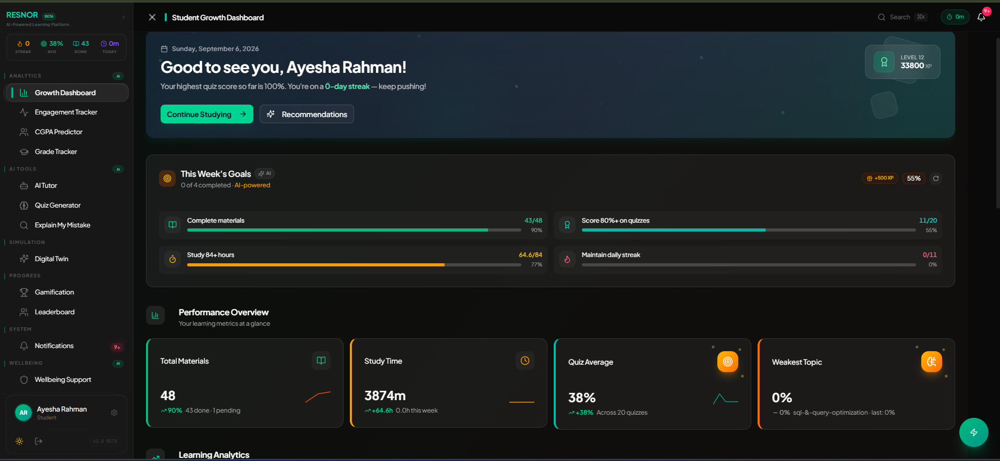
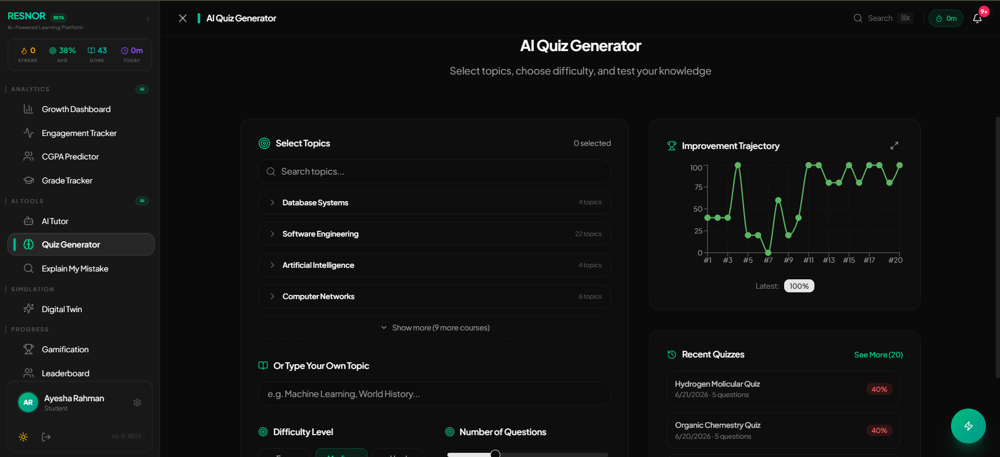
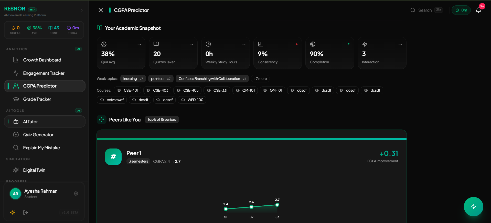
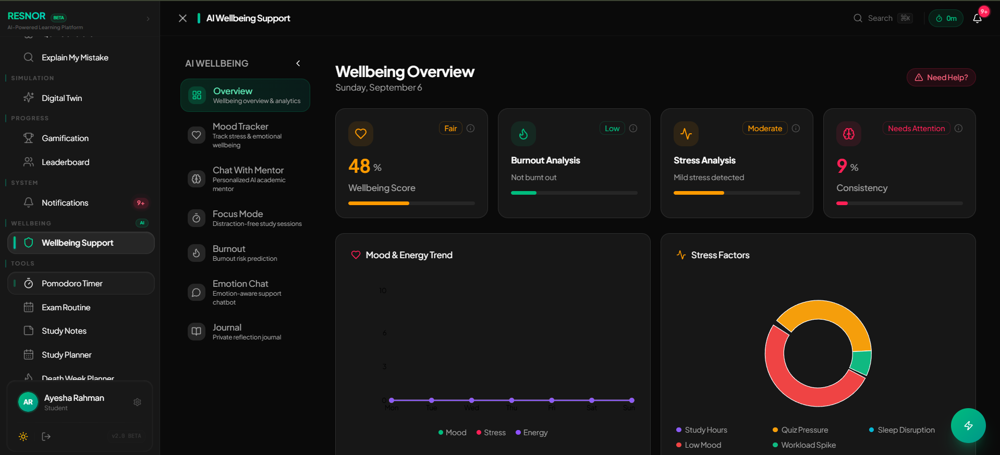
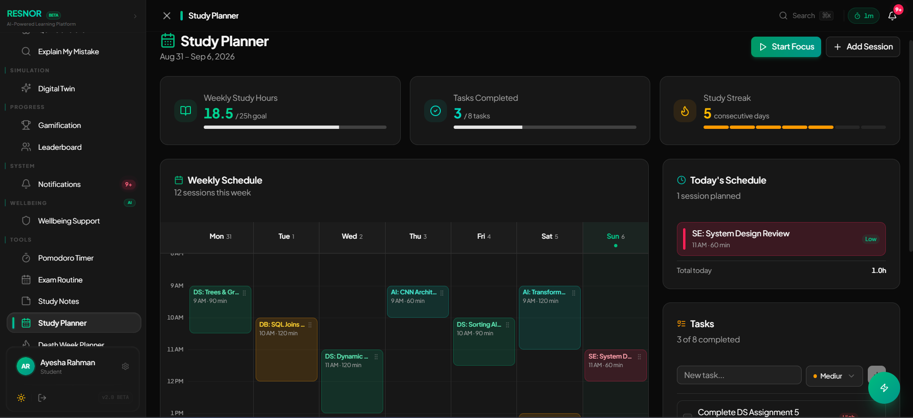
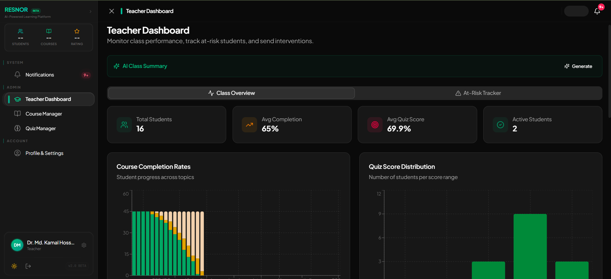

# RESNOR — AI-Powered Student Growth Platform

> An intelligent AI-powered platform designed to help students learn, grow, stay productive, and receive personalized academic support through modern technology.

## Live Demo

[**Visit RESNOR**](https://proffessorl-rafidai.vercel.app/)

---

## About the Project

RESNOR is an **AI-powered student growth platform** designed to support students throughout their academic journey by combining artificial intelligence, personalized learning, productivity, and intelligent assistance in a single platform.

The platform focuses on helping students **learn more effectively, improve their skills, manage their academic activities, and receive personalized guidance** through a modern and interactive digital experience.

RESNOR brings together AI-powered assistance and student-focused features to create a centralized environment where students can learn, practice, improve, and track their personal growth.

The project explores how **artificial intelligence and modern web technologies** can be used to create smarter, more engaging, and personalized educational experiences for students.

---

## Key Features

*  AI-Powered Student Assistance
*  AI Wellbeing Support
*  Digital Twin
*  Smart Study Planner
*  AI assist Teacher Dashboard
*  Personalized Academic Guidance
*  Student Growth & Development
*  Intelligent Recommendations

---

## Screenshots

### Student Dashboard



### Course based Quiz Generator



### CGPA Predictor



### AI Wellbeing Support



### Smart Study Planner



### AI Assist Teacher Dashboard



---

##  AI-Powered Experience

RESNOR uses artificial intelligence to provide students with a more interactive and personalized learning experience.

The AI-powered platform is designed to assist students with:

*  Learning and academic support
*  Understanding different concepts
*  Problem-solving assistance
*  Academic guidance
*  Personalized recommendations
*  Skill and personal development
*  Interactive conversations

The goal is to make AI a practical learning companion that can support students throughout their academic journey.

---

##  Student Growth

RESNOR focuses on different aspects of student development.

###  Learning

Helping students explore topics, understand concepts, and improve their academic knowledge.

###  Skill Development

Encouraging students to continuously develop their technical, academic, and problem-solving skills.

###  Progress

Creating a structured environment where students can monitor their learning and development.

###  Productivity

Supporting students in managing their academic activities and maintaining productive learning habits.

###  AI Assistance

Providing intelligent support and guidance whenever students need help.

---

## Intelligent Learning

RESNOR aims to make the learning process more interactive and personalized.

Instead of providing the same experience to every student, the platform focuses on delivering intelligent assistance based on the student's needs, interests, and learning goals.

This approach creates a flexible and engaging learning environment where students can learn at their own pace.

---

## Project Objectives

The primary objectives of RESNOR are:

* To create an AI-powered platform for students
* To provide personalized academic assistance
* To make learning more interactive and accessible
* To encourage continuous student development
* To improve academic productivity
* To integrate AI into everyday student activities
* To create a centralized student growth ecosystem
* To explore practical applications of AI in education

---

##  Why RESNOR?

Traditional educational platforms mainly focus on providing educational content.

RESNOR aims to go beyond that by combining **AI assistance, learning, productivity, personalization, and student development** into a single platform.

The vision is to create an environment where students can:

> **Learn → Practice → Improve → Track → Grow**

all within one intelligent ecosystem.

---

##  User Experience

RESNOR is designed with a strong focus on creating a modern and user-friendly experience.

The platform focuses on:

* Clean and modern interface
* Simple navigation
* Responsive layouts
* Interactive components
* Student-friendly design
* Smooth user interactions
* Modern visual elements
* Accessible user experience

---

##  Responsive Design

RESNOR is designed to provide a consistent experience across different devices:

*  Desktop
*  Laptop
*  Mobile
*  Tablet

The interface adapts to different screen sizes to provide a smooth and user-friendly experience.

---

##  Technologies Used

###  Web Technologies

* HTML5
* CSS3
* JavaScript
* Modern UI/UX
* Responsive Web Design

###  Artificial Intelligence

* AI-Powered Assistance
* Intelligent Interactions
* Personalized Learning Support
* AI-Driven Recommendations

###  Deployment

* Vercel

---

##  Getting Started

### Clone the Repository

```bash
git clone YOUR_GITHUB_REPOSITORY_URL
```

### Navigate to the Project

```bash
cd RESNOR
```

### Install Dependencies

```bash
npm install
```

### Run Locally

```bash
npm run dev
```

Open your browser and visit:

```text
http://localhost:3000
```

---

##  Future Development

RESNOR is designed with future expansion in mind.

Potential improvements include:

*  Advanced AI Tutoring
*  Advanced Student Analytics
*  Personalized Learning Paths
*  AI-Generated Study Materials
*  Smart Quiz Generation
*  Goal-Based Learning Plans
*  Detailed Progress Analytics
*  Advanced AI Conversations
*  Smart Academic Reminders
*  Teacher & Mentor Integration
*  Community-Based Learning
*  Dedicated Mobile Application

---

##  Target Users

RESNOR is designed primarily for:

*  University Students
*  School & College Students
*  Programming Learners
*  AI & Technology Enthusiasts
*  Self-Learners
*  Students interested in personal development

---

##  Live Platform

Experience RESNOR:

[**Launch RESNOR →**](https://proffessorl-rafidai.vercel.app/)

---

##  Developer

### Raihan Chowdhury Nibir
### KNH Eusha
### Rafid Awosaf

**Computing and Information Systems (CIS),**
**Daffodil International University**


---

##  Let's Connect

I'm open to:

*  AI Projects
*  Web Development
*  AI Research
*  EdTech Projects
*  Product Development
*  Open Source Collaboration

### Connect with me

**GitHub:** [nibir-911](https://github.com/nibir-911)

**Portfolio:** [raihan-chowdhury-nibir.netlify.app](https://raihan-chowdhury-nibir.netlify.app/)

---

## License

This project is developed for educational, research, and product development purposes.

© 2026 Tram RESNOR. All rights reserved.
